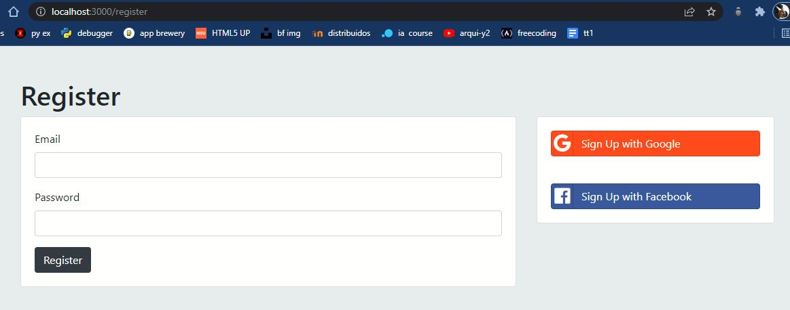
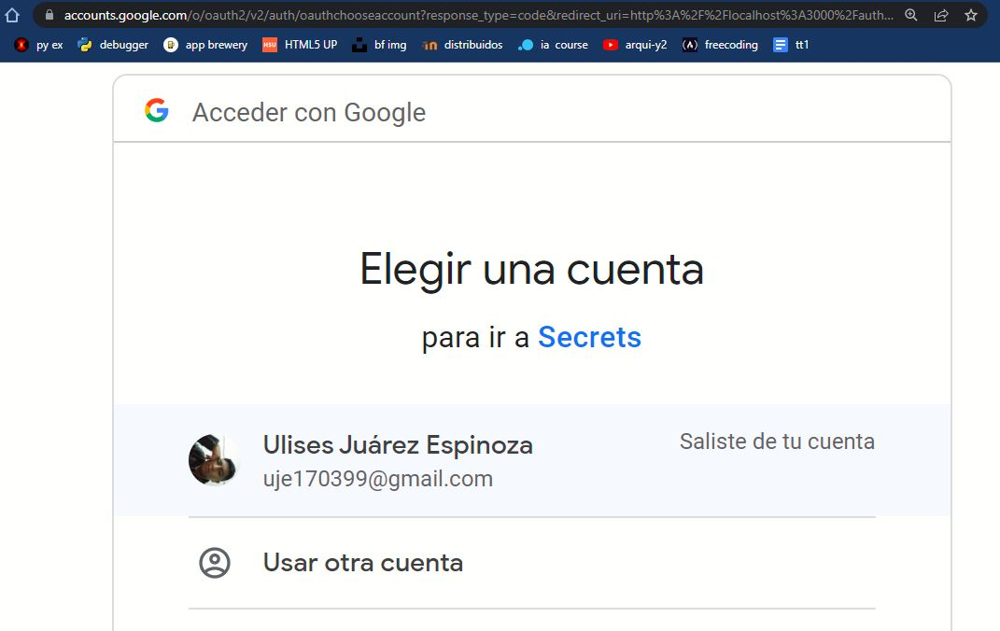
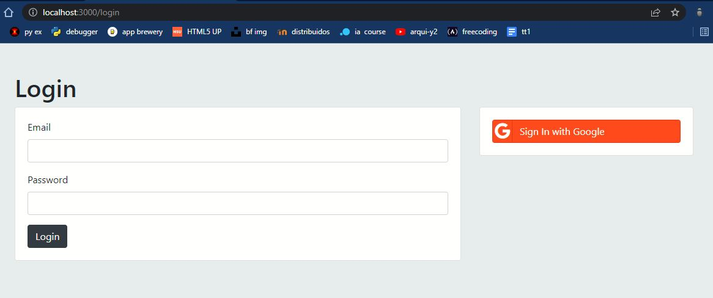
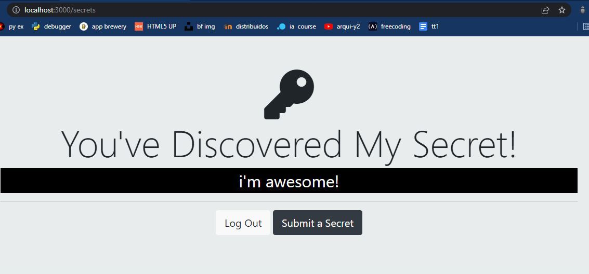

# Web security

En el presente proyecto se hizo de OAuth 2.0  para implementar un signup login seguro con Node.js

Se muestra la pagina de inicio.

Sí  presionamos "sign up" nos mandara a la página de registro.

Ahora podemos elegir la opción de registrarnos con google, gracias a OAuth 2.0, en cuyo caso nos mandará a la pagina de google para elegir nuestro correo y dar nuestros permisos.

Del mismo modo sí ya estamos registrardos y queremos iniciar sesión presionaremos "login" y se nos abrirá la siguiente página.

Podemos llenar el formulario o simplemente iniciar sesión con google en cuyo caso nos mandará a nuestra página de inicio.

